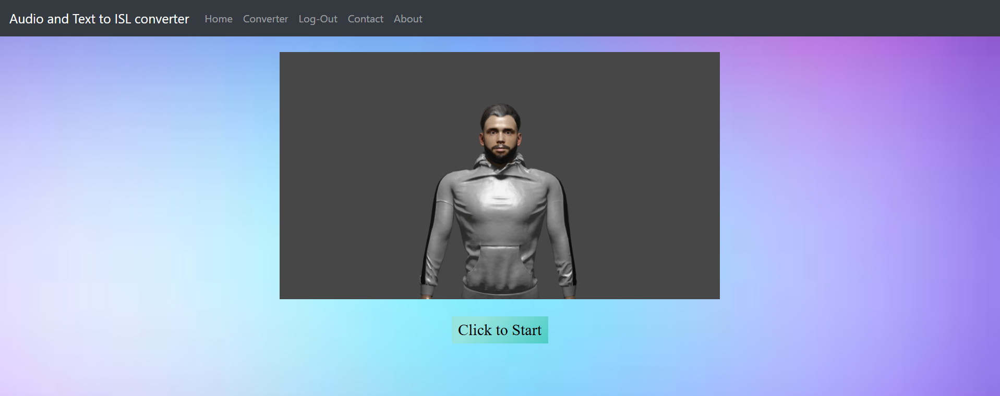
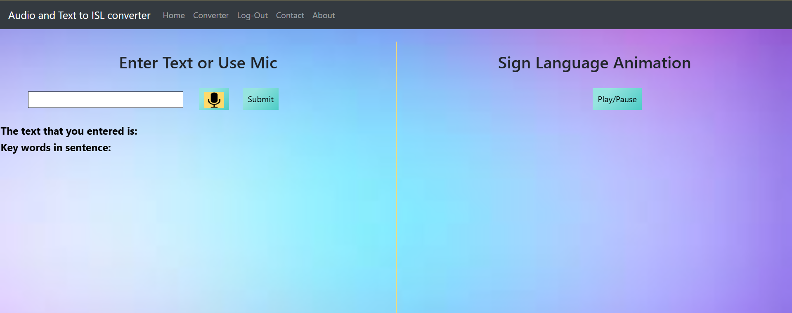
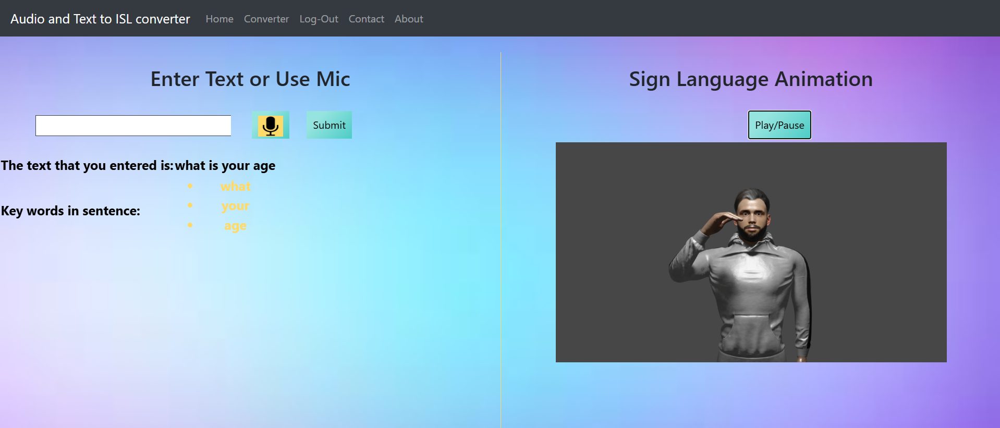

# 🎯 Audio and Text to Indian Sign Language Converter using NLP Techniques

## 🧩 Abstract
The **Audio and Text to Indian Sign Language Converter** is a transformative technological endeavor aimed at bridging communication barriers between the hearing-impaired and the general population. Leveraging advanced **Natural Language Processing (NLP)** techniques such as text and audio recognition, in conjunction with **3D animation using Blender**, this project provides a real-time translation of both text and speech inputs into engaging **Indian Sign Language (ISL)** animations.

The system is delivered through a **user-friendly web application**, enabling users to input single words or complete sentences and visualize them as ISL animations. Beyond communication facilitation, this project has applications in **healthcare, education, and assistive technology**, marking a significant advancement toward inclusivity and accessibility for the deaf and dumb community.

---

## 🧠 Introduction
The field of technology has evolved rapidly, particularly in **accessibility and communication**. One significant area is **Natural Language Processing (NLP)** — a branch of Artificial Intelligence that allows computers to interpret, manipulate, and understand human language.

Two major components of NLP — **Audio Recognition** and **Text Recognition** — play key roles in this project:

- **Audio Recognition:** Enables the system to interpret and process spoken language. Widely used in AI assistants like Alexa and Siri, it converts human speech into text.
- **Text Recognition:** Involves identifying and converting printed or handwritten text into machine-readable form.

This project integrates these technologies to convert **audio and text inputs into Indian Sign Language animations**. ISL is the primary mode of communication for the deaf and mute community. While platforms like YouTube or Google provide learning materials, users must manually search for each sign.  

Our goal is to create a **unified platform** where users can seamlessly convert spoken or written input into **3D ISL animations**, thus bridging communication gaps and promoting inclusivity.

To run the project, first clone the repository into your system, then run the following command:
```bash
python manage.py runserver
```

---

## ⚙️ Methodology

The system architecture is divided into several key components that process user input and generate corresponding ISL animations.

### 1️⃣ User Input Interface
Users can provide input either as:
- **Text** (typed into a text box)
- **Audio** (spoken input through a microphone)

If audio input is given, it is first converted into text using **speech recognition**.

---

### 2️⃣ Natural Language Processing (NLP) Pipeline
Once the text input is obtained, it undergoes multiple NLP preprocessing steps:

#### 🔹 A) Tokenization
The input text is first converted to lowercase for uniformity and then split into individual tokens (words) using NLTK’s `word_tokenize()` function.

#### 🔹 B) Part-of-Speech (POS) Tagging
Each tokenized word is assigned a grammatical tag (noun, verb, adjective, etc.) using NLTK’s `pos_tag()` function.

#### 🔹 C) Tense Detection
Verb forms are analyzed to determine sentence tense:
- **Future Tense:** Contains “MD” (modal verbs like *will*, *shall*)
- **Present Tense:** Contains “VBP”, “VBZ”, or “VBG”
- **Past Tense:** Contains “VBD” or “VBN”

#### 🔹 D) Stopwords Removal
Common words such as “is,” “the,” “and” are removed, as they are not represented in ISL.

#### 🔹 E) Lemmatization
Words are reduced to their root form using NLTK’s `WordNetLemmatizer` (e.g., “waiting” → “wait”) to simplify animation lookup.

#### 🔹 F) Tense-Based Sentence Modification
Depending on detected tense:
- Past tense → Prefix **“Before”**
- Present tense → Prefix **“Now”**
- Future tense → Prefix **“Will”**

This improves ISL translation accuracy by emphasizing time context.

---

### 3️⃣ Animation Retrieval and Rendering
After NLP processing:
- The system searches for the corresponding **3D sign animations** in the dataset.
- If a specific word animation exists → it is rendered directly.
- If not found → the word is split into individual letters, and animations for each character are displayed sequentially.

The **3D animations** were designed and rendered using **Blender**, ensuring natural hand and body movements for ISL representation.

---

## 📸 Results

Below are the visuals and demo illustrating the working of our **Audio and Text to Indian Sign Language Converter** web application.

---

### 🌐 Website Interface

**Main Page of the Website:**


**Converter Page of the Model:**


---

### 🧏‍♀️ Example Outputs

**Example 1 — Sentence: “I am happy”**


**Example 2 — Sentence: “What is your age”**


---

### 🎥 Demo Video

Watch the live demonstration of our system in action:  
[🎬 Click here to view the Demo Video](media/demo_video.mp4)

The video cannot be played directly from the system, so you can download the same on your system.

---

## 🧩 Conclusion
We developed a **web-based ISL converter** capable of transforming **audio and text inputs into 3D sign language animations** using NLP techniques. The system demonstrates how linguistic processing can enhance accessibility tools for differently-abled individuals.

It can be extended for **real-time translation**, **educational platforms**, and **healthcare communication tools**, promoting inclusivity for the hearing-impaired community. The integration of **AI and 3D animation** represents a powerful step forward in the field of **assistive technology**.

---

## 🧰 Tech Stack

| Component | Technology Used |
|------------|----------------|
| **Programming Language** | Python |
| **Frontend** | HTML, CSS, JavaScript |
| **Backend Framework** | Flask |
| **Speech Recognition** | SpeechRecognition (Python Library) |
| **Text Processing** | NLTK (Tokenization, POS Tagging, Lemmatization) |
| **3D Animation** | Blender |
| **Database** | Custom word–animation mapping |
| **Deployment** | Web-based interface |

---

## 👨‍💻 Author

👤 Name : **Pranav Agwan** 

📧 Mail : agwanpranav123@gmail.com 

🔗 LinkedIn Profile : www.linkedin.com/in/pranav-agwan-84b80b211  

